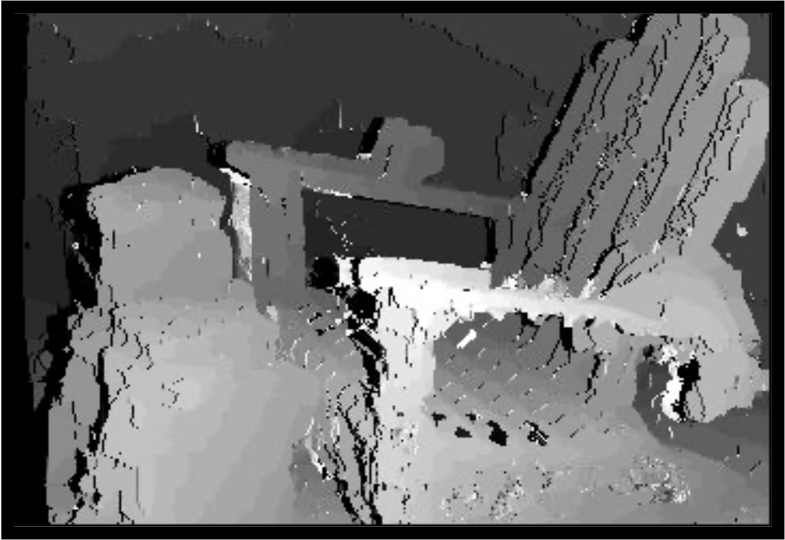
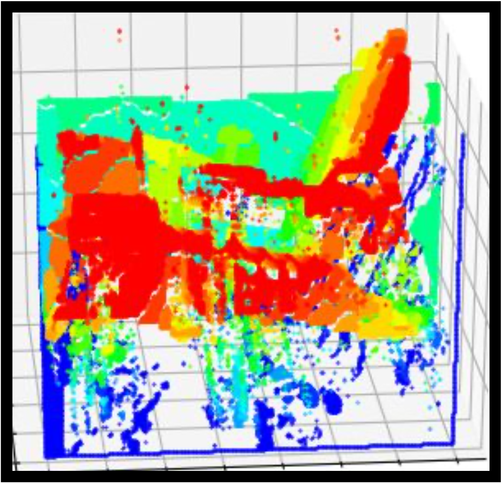
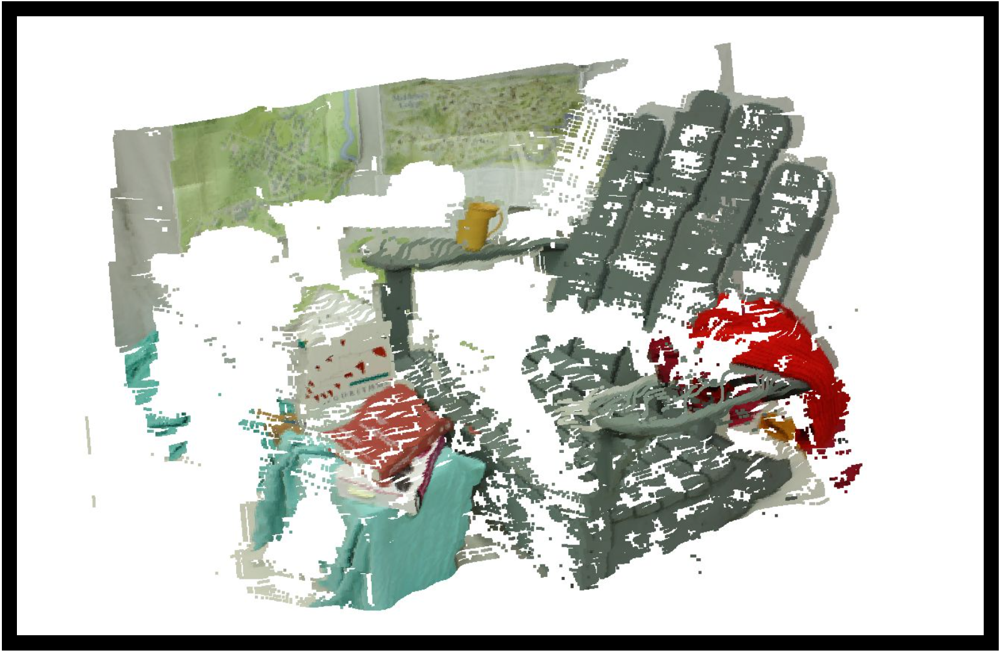

# Stereoscopic Point Cloud Generation

This program uses two 2D images as captured by a left and right camera to generate a 3D model of a scene. This allows depth awareness in software through a process similar to that of the brain.

A brief summary of the process is provided below, but a detailed description (including theory) is available <a href="">here</a>.

## Some Results

<p float="left">
  <div style="display: inline-block; width: 32%">
    <h4>Input Image</h4>
    
    </div>
<div style="display: inline-block; width: 32%">
    <h4>Disparity Map</h4>
    
  </div>  
<div style="display: inline-block; width: 23%">
    <h4>Disparity Map (angled)</h4>
    
  </div>  
</p>

<p float="left">
  <div style="display: inline-block; width: 49%">
    <h4>Raw Point Cloud</h4>
    
    </div>
<div style="display: inline-block; width: 49%">
    <h4>Processed Point Cloud</h4>
    
  </div>  
</p>


## Running

```bash
    python3 main.py
```
